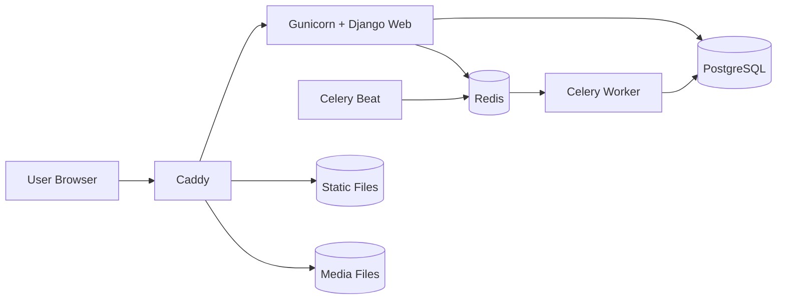
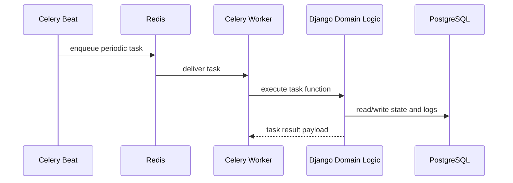

# Architecture

## System Overview

The application is a Django-based portfolio/blog platform with asynchronous background processing.
Core runtime services are orchestrated with Docker Compose:

- `web`: Django app served by Gunicorn.
- `db`: PostgreSQL database.
- `redis`: message broker/result backend for Celery.
- `worker`: Celery worker for asynchronous jobs.
- `beat`: Celery beat scheduler for periodic jobs.
- `caddy`: reverse proxy and static/media serving.

## High-Level Diagram

## Backend Architecture

## Asynchronous Processing

Celery is used for jobs that should not block HTTP requests.

- Broker/backend: Redis (`CELERY_BROKER_URL`, `CELERY_RESULT_BACKEND`).
- Periodic schedule: `CELERY_BEAT_SCHEDULE` in `django/config/settings.py`.
- Notable periodic job: `main.tasks.sync_project_markdowns_task`.
- Task observability: `TaskExecutionStatus` and `TaskExecutionLog` store latest and historical run metadata.

### Async Flow Diagram

## Static and Media Delivery

- Django collects static files into `/app/staticfiles`.
- User uploads are stored in `/app/media`.
- Docker named volumes share these directories with Caddy.
- Caddy serves static/media directly for efficiency.

## Security and Configuration

- Environment variables are loaded from `.env` via `django-environ`.
- `SECRET_KEY` is required; startup fails if missing.
- In non-debug mode, secure cookie and HTTPS settings are enabled.
- Allowed hosts and CSRF trusted origins are controlled by env vars.

