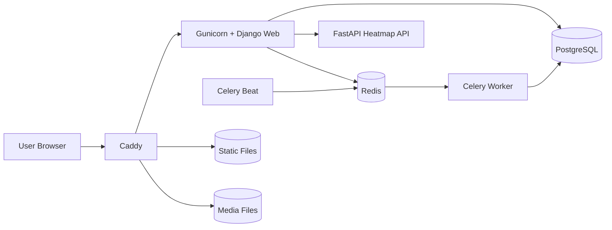
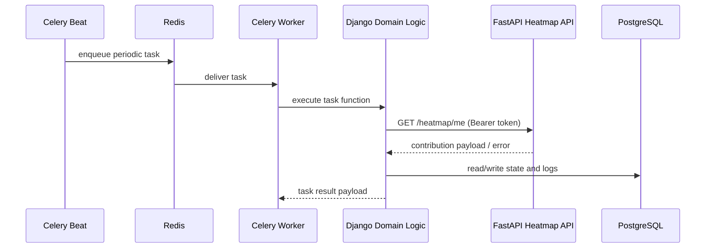

# Architecture

## System Overview

The application is a Django-based portfolio/blog platform with asynchronous background processing.
Core runtime services are orchestrated with Docker Compose:

- `web`: Django app served by Gunicorn.
- `db`: PostgreSQL database.
- `redis`: message broker/result backend for Celery.
- `worker`: Celery worker for asynchronous jobs.
- `beat`: Celery beat scheduler for periodic jobs.
- `caddy`: reverse proxy and static/media serving.

An optional external FastAPI service provides GitHub contribution heatmap data consumed by Django.

## High-Level Diagram

## Backend Architecture

### Django Layering

- `django/config/`: project configuration (`settings.py`, `urls.py`, `celery.py`).
- `django/main/models.py`: domain entities, including projects and task execution status/logging.
- `django/main/views.py`: request handling and template rendering.
- `django/main/tasks.py`: asynchronous and scheduled task execution.
- `django/main/markdown_sync.py` and `django/main/heatmap.py`: integration and domain helpers.

### Request Flow

1. A request reaches Caddy.
2. Caddy forwards dynamic routes to Gunicorn/Django.
3. Django middleware runs (`SecurityMiddleware`, sessions, visitor counter, CSRF, auth, etc.).
4. Views read or write data through Django ORM.
5. Templates render HTML using shared context processors.
6. The response is returned through Caddy.

## Asynchronous Processing

Celery is used for jobs that should not block HTTP requests.

- Broker/backend: Redis (`CELERY_BROKER_URL`, `CELERY_RESULT_BACKEND`).
- Periodic schedule: `CELERY_BEAT_SCHEDULE` in `django/config/settings.py`.
- Notable periodic job: `main.tasks.sync_project_markdowns_task`.
- Task observability: `TaskExecutionStatus` and `TaskExecutionLog` store latest and historical run metadata.

## FastAPI Integration

The project supports an optional FastAPI integration for GitHub contribution heatmap data.

- Base URL is configured with `HEATMAP_API_BASE_URL`.
- Django calls `{HEATMAP_API_BASE_URL}/heatmap/me` with a GitHub bearer token.
- Data is validated and persisted in `HeatmapSnapshot`.
- On FastAPI/network errors, Django returns safe fallback messages and keeps the last valid snapshot.

### Async Flow Diagram

## Static and Media Delivery

- Django collects static files into `/app/staticfiles`.
- User uploads are stored in `/app/media`.
- Docker named volumes share these directories with Caddy.
- Caddy serves static/media directly for efficiency.

## Security and Configuration

- Environment variables are loaded from `.env` via `django-environ`.
- `SECRET_KEY` is required; startup fails if missing.
- In non-debug mode, secure cookie and HTTPS settings are enabled.
- Allowed hosts and CSRF trusted origins are controlled by env vars.

## Extensibility Notes

- Keep views thin; move business logic into helpers/services/tasks.
- Keep task payloads and return structures stable.
- Add new periodic jobs through `CELERY_BEAT_SCHEDULE` and explicit task logging.
