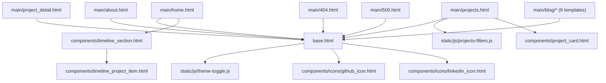

# Frontend Diagram

This diagram shows how the template layer is composed around the shared base layout and reusable UI components.

Related docs:

- [`README.md`](../README.md)
- [`architecture.md`](architecture.md)
- [`implementation.md`](implementation.md)

