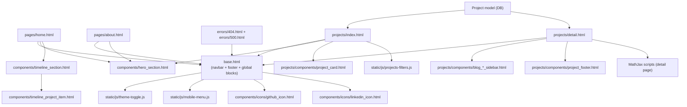

# Frontend Diagram

This diagram shows the current template composition around the shared layout, footer, and reusable components.

Related docs:

- [`README.md`](../README.md)
- [`architecture.md`](architecture.md)
- [`implementation.md`](implementation.md)

## Template structure

- `base.html` is the root layout for all pages. It contains the navbar, global scripts, and the global footer.
- Every page extends `base.html` and fills the main blocks (`content`, optional `sidebar`, optional `extra_scripts`).
- In practice there are 3 main page types inside this structure:
  1. static/content pages (`pages/home.html`, `pages/about.html`, error pages),
  2. projects listing (`projects/index.html`),
  3. project detail/blog page (`projects/detail.html`).
- `projects/detail.html` is rendered per project entry from the database (`Project`), resolved by slug (`/blog/<slug>/`).

